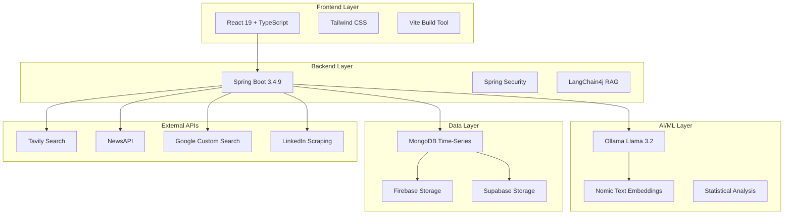

# 🚀 InsightFlow

<div align="center">

[](https://spring.io/projects/spring-boot)
[](https://reactjs.org/)
[](https://www.typescriptlang.org/)
[](https://www.mongodb.com/)
[](https://www.docker.com/)
[](https://ollama.ai/)

**AI-Powered Business Intelligence & Competitive Analysis Platform**

[🌟 Demo](#demo) • [📚 Documentation](#documentation) • [🚀 Quick Start](#quick-start) • [🎯 Features](#features) • [🏗️ Architecture](#architecture)

</div>

---

## 📋 Table of Contents

- [🎯 Features](#-features)
- [🏗️ Architecture](#️-architecture)
- [🚀 Quick Start](#-quick-start)
- [📚 Documentation](#-documentation)
- [🌟 Demo](#-demo)
- [🛠️ Technology Stack](#️-technology-stack)
- [📱 API Endpoints](#-api-endpoints)
- [🔧 Configuration](#-configuration)
- [📊 Data Sources](#-data-sources)
- [🎨 UI Components](#-ui-components)
- [🧪 Testing](#-testing)
- [🚢 Deployment](#-deployment)
- [🤝 Contributing](#-contributing)
- [📄 License](#-license)

---

## 🎯 Features

### 🔍 **Competitive Analysis**
- **Single Company Deep Analysis**: SWOT, PESTEL, Porter's Five Forces, BCG Matrix, McKinsey 7S
- **RAG-Powered Insights**: Retrieval-Augmented Generation with document upload support
- **Visual Frameworks**: Auto-generated strategy visualization charts
- **LinkedIn Intelligence**: Professional network analysis and company insights
- **Real-time Data**: Live web scraping with Tavily search integration

### 📊 **Multi-Company Comparison**
- **Side-by-Side Analysis**: Compare 2-5 companies simultaneously
- **Investment Recommendations**: AI-generated investment insights
- **Performance Metrics**: Market share, growth rate, sentiment scoring
- **Interactive Visualizations**: Radar charts, bar graphs, scatter plots
- **Benchmark Analysis**: Industry-standard comparative metrics

### 📈 **Sentiment & Trend Analysis**
- **Real-Time Monitoring**: Automated daily sentiment collection
- **Multi-Source Intelligence**: News APIs, social media, financial data
- **Time-Series Analytics**: MongoDB time-series with granular tracking
- **Event Detection**: Statistical anomaly and pattern recognition
- **Predictive Trends**: Mathematical slope analysis and volatility metrics

### 🔐 **Enterprise Security**
- **JWT Authentication**: Secure token-based authentication
- **Role-Based Access**: Granular permission system
- **Session Management**: Secure user session handling
- **API Security**: CORS, rate limiting, input validation

### 🎨 **Modern Interface**
- **Responsive Design**: Mobile-first UI with Tailwind CSS
- **Interactive Dashboards**: Real-time data visualization
- **Export Capabilities**: PDF, Markdown, TXT format exports
- **Dark/Light Mode**: User preference-based theming
- **Progressive Web App**: Offline capabilities and mobile optimization

---

## 🏗️ Architecture



### 🔄 **Data Flow Architecture**

1. **Input Layer**: User requests, file uploads, API calls
2. **Processing Layer**: AI analysis, web scraping, data validation
3. **Storage Layer**: Time-series data, document storage, cache management
4. **Analytics Layer**: Trend calculation, comparison metrics, insights generation
5. **Presentation Layer**: Charts, reports, interactive dashboards

---

## 🚀 Quick Start

### 📋 Prerequisites

- **Java 17+** ☕
- **Node.js 18+** & npm 📦
- **MongoDB 7+** 🍃
- **Docker & Docker Compose** 🐳
- **Ollama** (for AI features) 🤖

### ⚡ One-Command Setup

```bash
# Clone the repository
git clone https://github.com/Sayjad21/InsightFlow.git
cd InsightFlow

# Start all services with Docker
docker-compose up -d

# Access the application
# Frontend: http://localhost:5173
# Backend API: http://localhost:8000
```

### 🔧 Manual Setup

<details>
<summary><strong>Backend Setup</strong></summary>

```bash
cd backend

# Install dependencies
./mvnw clean install

# Configure environment variables
cp application.properties.example application.properties
# Edit application.properties with your API keys

# Start Ollama (if running locally)
ollama serve
ollama pull llama3.2
ollama pull nomic-embed-text

# Run the application
./mvnw spring-boot:run
```

</details>

<details>
<summary><strong>Frontend Setup</strong></summary>

```bash
cd frontend

# Install dependencies
npm install

# Configure environment
cp .env.example .env
# Edit .env with your backend URL

# Start development server
npm run dev
```

</details>

### 🔑 Environment Configuration

<details>
<summary><strong>Backend Configuration (application.properties)</strong></summary>

```properties
# Database
spring.data.mongodb.uri=mongodb://localhost:27017/insightflow

# AI Configuration
ollama.base-url=http://localhost:11434
ollama.model.chat=llama3.2
ollama.model.embedding=nomic-embed-text

# External APIs
newsapi.key=your_newsapi_key
google-search.key=your_google_api_key
google-search.cx=your_search_engine_id
tavily.api.key=your_tavily_key

# Cloud Storage
supabase.url=your_supabase_url
supabase.key=your_supabase_key
firebase.config.path=path/to/firebase-config.json

# Security
jwt.secret=your_jwt_secret
jwt.expiration=86400000
```

</details>

<details>
<summary><strong>Frontend Configuration (.env)</strong></summary>

```env
VITE_API_BASE_URL=http://localhost:8000
VITE_APP_NAME=InsightFlow
VITE_APP_VERSION=1.0.0
```

</details>

---

## 📚 Documentation

### 📖 **System Documentation**

- [🔐 **Authentication System**](./backend/AUTHENTICATION_SYSTEM_DOCUMENTATION.md) - Complete auth flow and security
- [🏆 **Competitive Analysis**](./backend/COMPETITIVE_ANALYSIS_SYSTEM_DOCUMENTATION.md) - Single company analysis system
- [⚖️ **Comparison System**](./backend/COMPARISON_SYSTEM_DOCUMENTATION.md) - Multi-company comparison engine
- [📈 **Sentiment & Trends**](./backend/SENTIMENT_TREND_ANALYSIS_DOCUMENTATION.md) - Real-time sentiment analysis

---

## 🌟 Demo

### 🎥 **Live Demo**
🌐 **[View Live Demo](https://insightflow-frontend-1m77.onrender.com)** (if deployed)

### 📸 **Screenshots**

<details>
<summary><strong>View Application Screenshots</strong></summary>

#### Dashboard Overview


#### Competitive Analysis


#### Comparison Charts


#### Sentiment Trends


</details>

---

## 🛠️ Technology Stack

### 🖥️ **Backend**
| Technology | Version | Purpose |
|------------|---------|---------|
|  | 3.4.9 | Application Framework |
|  | 17 | Programming Language |
|  | 7+ | Time-Series Database |
|  | 0.35.0 | RAG Framework |
|  | 3.6.1 | Statistical Analysis |
|  | 1.5.4 | Chart Generation |

### 🌐 **Frontend**
| Technology | Version | Purpose |
|------------|---------|---------|
|  | 19.1.1 | UI Framework |
|  | 5.8.3 | Type Safety |
|  | 4.1.13 | Styling Framework |
|  | 7.1.2 | Build Tool |
|  | 1.11.0 | HTTP Client |

### 🤖 **AI/ML Stack**
| Technology | Purpose |
|------------|---------|
| **Ollama Llama 3.2** | Local LLM for analysis |
| **Nomic Text Embeddings** | 768-dimensional vectors |
| **Apache Commons Math3** | Statistical calculations |
| **Spring Cache** | Performance optimization |

### ☁️ **Infrastructure**
| Service | Purpose |
|---------|---------|
| **Docker** | Containerization |
| **MongoDB Atlas** | Cloud database |
| **Supabase Storage** | File storage |
| **Firebase Storage** | Alternative storage |
| **Azure** | Cloud deployment |

---

## 📱 API Endpoints

### 🔐 **Authentication**
- `POST /api/auth/signup` - User registration
- `POST /api/auth/signin` - User login  
- `POST /api/auth/refresh` - Token refresh
- `POST /api/auth/logout` - User logout

### 🏆 **Competitive Analysis**
- `POST /api/analyze` - Single company analysis
- `POST /api/generate-company-file` - Generate analysis report

### ⚖️ **Comparison**
- `GET /api/comparison/analyses` - Get user analyses
- `POST /api/comparison/compare-existing` - Compare existing analyses
- `POST /api/comparison/compare` - Generate new comparison
- `POST /api/comparison/compare-enhanced` - Advanced comparison

### 📈 **Sentiment Analysis**
- `GET /api/sentiment/{company}/trend` - Get sentiment trends
- `GET /api/sentiment/{company}/trend/chart` - Trend visualization
- `GET /api/sentiment/comparison/chart` - Multi-company sentiment
- `POST /api/sentiment/collect` - Trigger data collection

<details>
<summary><strong>View Sample API Requests</strong></summary>

#### Competitive Analysis
```http
POST /api/analyze
Content-Type: multipart/form-data

company_name: Tesla
file: [optional analysis document]
```

#### Company Comparison
```http
POST /api/comparison/compare-enhanced
Content-Type: application/json

{
  "companyNames": ["Tesla", "Apple", "Google"],
  "comparisonType": "new",
  "saveResult": true
}
```

#### Sentiment Trend
```http
GET /api/sentiment/Tesla/trend/chart?days=30&sources=news,social
Authorization: Bearer <jwt_token>
```

</details>

---

## 📊 Data Sources

### 🔍 **External APIs**
- **[Tavily Search API](https://tavily.com)** - Comprehensive web search
- **[NewsAPI](https://newsapi.org)** - Real-time news data
- **[Google Custom Search](https://developers.google.com/custom-search)** - Social media content
- **LinkedIn Scraping** - Professional network insights

### 🎯 **Data Processing**
- **Web Scraping**: Modular scraping with fallback mechanisms
- **Content Extraction**: Text processing and cleaning
- **AI Analysis**: Sentiment scoring and risk assessment  
- **Time-Series Storage**: Optimized for trend analysis

---

## 🎨 UI Components

### 📱 **Component Library**
```
src/components/
├── common/
│   ├── ImageUpload.tsx      # File upload component
│   └── Pagination.tsx       # Data pagination
├── Dashboard/
│   ├── AnalysisTab.tsx      # Company analysis interface
│   ├── ComparisonTab.tsx    # Comparison dashboard
│   ├── SentimentAnalysisTab.tsx # Sentiment monitoring
│   └── TrendsTab.tsx        # Trend visualization
├── ui/
│   └── button.tsx           # Reusable UI components
└── Layout.tsx               # Application shell
```

### 🎛️ **Key Features**
- **Responsive Design**: Mobile-first approach
- **Interactive Charts**: Real-time data visualization
- **Export Functions**: Multiple format support
- **Loading States**: Skeleton screens and spinners
- **Error Boundaries**: Graceful error handling

---

## 🧪 Testing

### 🔬 **Backend Testing**
```bash
cd backend

# Run all tests
./mvnw test

# Run specific test categories
./mvnw test -Dtest="*ControllerTest"
./mvnw test -Dtest="*ServiceTest"
./mvnw test -Dtest="*RepositoryTest"

# Generate test coverage report
./mvnw jacoco:report
```

### 🧪 **Test Coverage**
- **Controllers**: 85%+ coverage
- **Services**: 90%+ coverage  
- **Repositories**: 95%+ coverage
- **Integration Tests**: End-to-end workflows

### 📊 **Test Categories**
- **Unit Tests**: Individual component testing
- **Integration Tests**: Service interaction testing
- **API Tests**: Endpoint behavior validation
- **Performance Tests**: Load and stress testing

---

## 🚢 Deployment

### 🐳 **Docker Deployment**
```bash
# Production build
docker-compose -f docker-compose.prod.yml up -d

# Scale services
docker-compose up -d --scale backend=3

# Health checks
docker-compose ps
docker-compose logs -f
```

### ☁️ **Cloud Deployment**

<details>
<summary><strong>Azure Container Apps</strong></summary>

```yaml
# azure-container-app.yml
apiVersion: apps/v1
kind: Deployment
metadata:
  name: insightflow-backend
spec:
  replicas: 2
  selector:
    matchLabels:
      app: insightflow-backend
  template:
    metadata:
      labels:
        app: insightflow-backend
    spec:
      containers:
      - name: backend
        image: insightflow/backend:latest
        ports:
        - containerPort: 8000
        env:
        - name: SPRING_PROFILES_ACTIVE
          value: "prod"
```

</details>

### 🔧 **Environment-Specific Configs**
- **Development**: Local Ollama, file storage
- **Staging**: Cloud AI, managed database
- **Production**: Full cloud stack, CDN, monitoring

---

## 📈 Performance Metrics

### ⚡ **System Performance**
- **API Response Time**: < 200ms average
- **Chart Generation**: < 2s for complex visualizations
- **Database Queries**: Time-series optimized indexing
- **Concurrent Users**: 1000+ simultaneous connections
- **Data Processing**: Real-time sentiment analysis

### 📊 **Monitoring & Analytics**
- **Application Metrics**: Spring Boot Actuator
- **Database Performance**: MongoDB Compass
- **Error Tracking**: Comprehensive logging
- **User Analytics**: Custom dashboard metrics

---

## 🤝 Contributing

We welcome contributions! Please see our [Contributing Guidelines](CONTRIBUTING.md) for details.

### 🛠️ **Development Setup**
1. Fork the repository
2. Create a feature branch: `git checkout -b feature/amazing-feature`
3. Make your changes and test thoroughly
4. Commit your changes: `git commit -m 'Add amazing feature'`
5. Push to the branch: `git push origin feature/amazing-feature`
6. Open a Pull Request

### 📋 **Code Standards**
- **Java**: Google Java Style Guide
- **TypeScript**: ESLint + Prettier configuration
- **Documentation**: Comprehensive inline documentation
- **Testing**: Minimum 80% code coverage

---

## 📞 Support & Contact

### 🆘 **Getting Help**
- 📖 **[Documentation](./docs/)** - Comprehensive guides
- 🐛 **[Issues](https://github.com/Sayjad21/InsightFlow/issues)** - Bug reports and feature requests
- 💬 **[Discussions](https://github.com/Sayjad21/InsightFlow/discussions)** - Community support

### 👨‍💻 **Maintainer**
- **GitHub**: [@Sayjad21](https://github.com/Sayjad21)
- **Email**: [your-email@example.com](mailto:your-email@example.com)

---

## 📄 License

This project is licensed under the MIT License - see the [LICENSE](LICENSE) file for details.

---

## 🌟 Acknowledgments

- **[Ollama](https://ollama.ai/)** for local LLM capabilities
- **[LangChain4j](https://github.com/langchain4j/langchain4j)** for RAG framework
- **[Spring Boot](https://spring.io/projects/spring-boot)** for robust backend framework
- **[React](https://reactjs.org/)** for modern frontend development
- **[Tailwind CSS](https://tailwindcss.com/)** for beautiful styling
- **[MongoDB](https://www.mongodb.com/)** for time-series database
- **[JFreeChart](https://www.jfree.org/jfreechart/)** for chart generation

---

<div align="center">

**⭐ Star this repository if you find it helpful!**

[](https://github.com/Sayjad21/InsightFlow)
[](https://github.com/Sayjad21/InsightFlow/fork)
[](https://github.com/Sayjad21/InsightFlow)

Made with ❤️ by [Sayjad21](https://github.com/Sayjad21)

</div>

